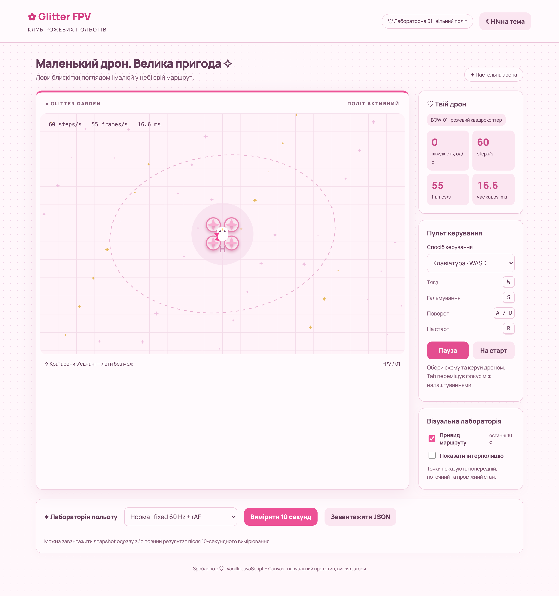
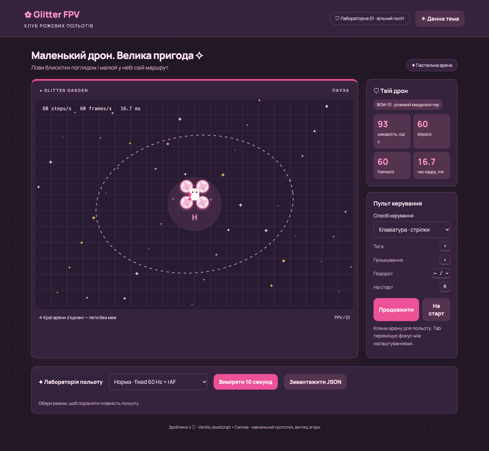

# ✿ Glitter FPV — клуб рожевих польотів

## Опубліковані версії

1. [Lab 01 — game loop](https://oljyaaa.github.io/kai_lab/lab-01/)
2. [Lab 02 — сутності та dogfight](https://oljyaaa.github.io/kai_lab/lab-02/)
3. [Lab 03 — async assets, звук і лобі](https://oljyaaa.github.io/kai_lab/lab-03/)

Навчальна браузерна гра про FPV-дрон BOW-01: вигляд згори, рожево-біла палітра, бантик, мультяшні пропелери та блискітки в естетиці Hello Kitty / kawaii. Це перший етап семестрового проєкту — локальний політ одного дрона; камера від першої особи й мережевий сервер поки не реалізовані.



## Запуск

Потрібні Node.js 24 (див. `.nvmrc`) та npm. Фактичні перевірки цього коміту виконані на Node 26.5.0.

```bash
nvm use
npm ci
npm run dev
```

Відкрий адресу, яку покаже Vite (зазвичай http://127.0.0.1:5173).

У картці «Візуальна лабораторія» увімкни «Привид маршруту», щоб побачити останні 10 секунд польоту, або «Показати інтерполяцію», щоб порівняти `previous`, `current` і проміжний стан `render (α)`.

```bash
npm test          # тести фізики, циклу, клавіатури
npm run check    # Biome: форматування та рекомендовані правила
npm run format   # автоматичне форматування
npm run build    # production у dist/
npm run preview  # перегляд production-збірки
```

Шрифт Manrope завантажується з Google Fonts і підтримує українську. Без інтернету гра використовує системний sans-serif. Починаючи з Lab 03 дрон, куля, астероїд і pickup малюються зі спрайтшита, що завантажується асинхронно.

## Що реалізовано покроково

### 1. Vite, vanilla JS та ES-модулі

Проєкт зібраний на Vite без UI-фреймворків. У `package.json` задано `"type": "module"`, HTML завантажує `src/main.js` через `type="module"`. Biome відповідає за форматування, лінтинг та порядок імпортів; lockfile фіксує залежності.

```js
import { createLoop } from './loop.js';
import { createShip, integrate } from './sim/ship.js';
```

Модулі мають власну область видимості, працюють у strict mode, використовують іменовані експорти. `main.js` з’єднує компоненти, а фізика не звертається до DOM.

```text
src/
  main.js          — інтерфейс, кнопки, експерименти, композиція
  loop.js          — createLoop(), акумулятор, статистика
  input.js         — createInput(), приватний стан клавіш
  sim/ship.js      — дані дрона, чиста фізика
  sim/arena.js     — арена 1000 × 660, wrap та інтерполяція
  render/canvas.js — DPR та ResizeObserver
  render/draw.js   — дрон, пропелери, арена, Canvas HUD
  style.css        — адаптивна рожева тема
tests/             — автоматичні перевірки та вимірювальні сценарії
docs/              — результати, скріншоти та план лабораторної
```

### 2. Фіксований цикл симуляції

`createLoop({ step, simulate, render })` повертає `start()`, `stop()` та `stats`. Типовий крок — `1 / 60` секунди. Час із rAF переводиться з мілісекунд у секунди, затримка обмежується 0.25 с, решта накопичується:

```js
accumulator += dt;
while (accumulator + 1e-12 >= step) {
  simulate(step);
  accumulator = Math.max(0, accumulator - step);
}
render(accumulator / step, stats);
```

Мала похибка `1e-12` компенсує округлення чисел із плаваючою комою. На 120 Hz кадрів більше, ніж кроків фізики; на повільнішому рендері за один кадр виконується кілька кроків. Повторний `start()` не створює другий цикл. Після паузи timestamp ініціалізується заново.

60 steps/s — ціль за нормального навантаження, а не гарантія за будь-якого зависання. Якщо минуло більше 250 ms, частина реального часу свідомо відкидається; `droppedSeconds` її рахує. Фіксований крок сам по собі не гарантує мережевий детермінізм: потрібні однакові початкові дані, послідовність input за тиками й кількість кроків.

HUD на Canvas та в картці показує steps/s, frames/s і проміжок між callback-ами у ms. Це не CPU-час виконання кадру. Частоти обчислюються за вікном щонайменше 1 секунди; одразу після старту показники ще нульові. У режимі setInterval frames/s означає виклики render, а не кількість фактично показаних монітором кадрів.

### 3. Клавіатура як замикання

`createInput(window)` зберігає приватні `Set` для затиснутих і щойно натиснутих клавіш. Методи мають доступ до цих змінних завдяки замиканню:

```js
const down = new Set();
const pressed = new Set();
// На keydown:
if (!down.has(event.code)) pressed.add(event.code);
down.add(event.code);
// Публічний API:
isDown: code => down.has(code),
justPressed: code => pressed.has(code)
```

`endStep()` очищає лише одноразові натискання після кроку симуляції. Автоповтор клавіатури не створює повторного `justPressed`. `blur` очищає клавіші, `destroy()` видаляє слухачів. Ігрові клавіші працюють і на сфокусованих кнопках; поля вводу, select, contenteditable та комбінації Ctrl/Meta/Alt не перехоплюються.

Керування обирається у «Пульті керування»: **WASD** (W — тяга, A/D — поворот, S — гальмування), **стрілки** (↑ — тяга, ←/→ — поворот, ↓ — гальмування) або **екранні кнопки** з Pointer Events і pointer capture. Неактивна схема не керує дроном. **R** повертає на старт. Після роботи з кнопками можна одразу керувати дроном; Tab лишається стандартною навігацією між елементами інтерфейсу.

### 4. Чиста фізика FPV-дрона

Стан — звичайний об’єкт `{ x, y, vx, vy, angle, thrust }`. `integrate(ship, input, dt)` повертає новий стан, не змінює аргументи, не використовує випадковість, DOM, Canvas або поточний час.

```js
const angle = ship.angle + (input.turn || 0) * PHYSICS.turn * dt;
const acceleration = input.thrust ? PHYSICS.acceleration : 0;
let vx = (ship.vx + Math.cos(angle) * acceleration * dt)
  * Math.exp(-PHYSICS.drag * dt);
// Аналогічно vy через sin(angle), потім clamp швидкості.
return { ...ship, x: ship.x + vx * dt, /* решта нового стану */ };
```

Приклади вище скорочені; повна функція — у `src/sim/ship.js`. Поворот: 3.2 rad/s; прискорення: 220 од/с²; drag: 0.55 с⁻¹; гранична швидкість: 260 од/с. Ці значення дають плавну інерцію, керований поворот та обмежену швидкість на маленькій арені. Це спрощена 2D-модель, не авіаційний симулятор.

### 5. Безшовна арена та інтерполяція

Координати нормалізуються навіть після від’ємного зміщення:

```js
const wrap = (n, size) => ((n % size) + size) % size;
```

Перед кожним кроком зберігається `previous`, після — `current`. Рендер отримує `alpha` між 0 та 1 й показує проміжний стан. Інтерполюється найкоротше зміщення і для координат на замкненій арені, і для кута: перехід `999 → 1` проходить через край, а не крізь центр. Копії дрона поблизу країв забезпечують плавне візуальне загортання. Інтерполяція додає до одного кроку візуального відставання.

### 6. Canvas, DPR та дизайн

Canvas має постійний світ 1000 × 660, але адаптується до ширини сторінки. `ResizeObserver` оновлює внутрішній bitmap; перевірка DPR враховує зміну масштабу або монітора:

```js
canvas.width = Math.round(cssWidth * dpr);
canvas.height = Math.round(cssHeight * dpr);
ctx.setTransform(canvas.width / 1000, 0, 0, canvas.height / 660, 0, 0);
```

`save → translate → rotate → draw → restore` розміщує квадрокоптер. Чотири пропелери обертаються швидше під тягою; позаду з’являються блискітки. Рожева сітка та пунктирний овал дають орієнтири; це декор, не колізії чи гоночні ворота. На телефоні картки переходять під арену.

### 7. Привид маршруту та інтерполяція

У «Візуальній лабораторії» є два незалежні перемикачі. «Привид маршруту» показує пунктиром останні 10 секунд траєкторії. Точки додаються тільки після `simulate(dt)`, тому це історія станів симуляції, а не частота кадрів монітора. Під час wrap-around лінія розривається, щоб не креслити хибний відрізок через всю арену.

```js
simulationTime += dt;
trail = appendTrail(trail, current, simulationTime);
```

«Показати інтерполяцію» малює: блакитну точку `previous`, рожеву `current` і жовту `render (α)`, а також пунктир між `previous` та `current`. Це показує проміжний стан, який рендерить браузер між фіксованими кроками фізики. Режими зберігаються у `localStorage` і не впливають на `integrate()`.

### 8. Лабораторія експериментів

Перемикач вибирає normal fixed+rAF, синхронний блок 100 ms кожного 60-го кадру, setInterval(16) або variable timestep. Перед зміною режиму старий цикл зупиняється. Кнопка вимірювання збирає 10 секунд проміжків кадрів і дозволяє завантажити JSON з усіма samples, min/max, середнім та стандартним відхиленням. Пауза або зміна режиму скасовує поточне вимірювання.

## Фактичні експерименти

Середовище: macOS, Node 26.5.0, Chrome 152.0.7977.77 через Playwright у headless-режимі, viewport 1440 × 1000, DPR 2. Це вимірювання тестового браузера, а не доказ поведінки фізичного 120/144 Hz монітора. Джерела: `docs/measurement-*.json`, `docs/browser-results.json`.

| Режим | Середній проміжок, ms | Максимум, ms | Jitter σ, ms |
|---|---:|---:|---:|
| Fixed + rAF | 16.67 | 16.80 | 0.06 |
| Блок 100 ms | 18.01 | 100.10 | 10.52 |
| setInterval(16) | 16.00 | 22.30 | 0.68 |
| Variable + rAF | 16.67 | 16.80 | 0.06 |

### Експеримент 1: синхронне блокування

```js
const end = performance.now() + 100;
while (performance.now() < end) { /* навмисне блокування */ }
```

Максимальний проміжок виріс до 100.10 ms. Поки цей callback виконується, інший JavaScript у тому самому потоці не може обробляти клавіші, microtasks чи наступний rAF. Promise не усуває синхронного блокування. Браузерні compositor-анімації можуть мати окремий потік; твердження стосується передусім головного потоку гри. Після затримки акумулятор наздоганяє симуляцію кількома кроками, але вже пропущене зображення не поверне.

### Експеримент 2: таймер замість rAF

За виміряними проміжками таймер працював приблизно 62.5 callback/s (`1000 / 16`), rAF — приблизно 60. Таймер не синхронізований з оновленням дисплея; σ зросла з 0.06 до 0.68 ms. Фіксована фізика й акумулятор в цьому експерименті залишаються такими самими: змінюється лише планувальник.

**Ще виконати особисто перед захистом:** у звичайному видимому браузері запустити цей режим, перейти на іншу вкладку рівно на 5 секунд та повернутися; повторити для rAF і записати результати. Headless-тест не замінює перевірку фонової вкладки. У фоні rAF зазвичай призупиняється, а таймери браузер обмежує — точна поведінка залежить від середовища.

### Експеримент 3: variable timestep і CPU 6×

`tests/throttle.mjs` задає CPU throttling через Chrome DevTools Protocol та однакову програмну тягу на рівно 5 секунд симуляції, щоб людська реакція не спотворювала результат. Вимірювальний сценарій використовує ту саму `integrate`, але не загортає координати й не обрізає delta; це окремий контрольований тест, не ручний політ у UI.

| Крок | CPU | Кількість steps | Кінцевий y |
|---|---:|---:|---:|
| Fixed | 1× | 300 | -765.3209449424874 |
| Fixed | 6× | 300 | -765.3209449424874 |
| Variable | 1× | 301 | -765.3209264741353 |
| Variable | 6× | 301 | -765.320993055883 |

У всіх випадках x = 500. Fixed-стани збіглися точно; variable відрізняються лише приблизно на 0.000067 одиниці. На цьому комп’ютері CPU 6× не спричинив помітного падіння частоти, тому цей запуск **не демонструє видимого розходження**. Не варто називати таку різницю помітною гравцеві.

Додатковий **синтетичний**, а не CPU-тест (`node tests/trajectory.js`): variable 60 кроків/с дає y = -765.320945, 10 кроків/с — y = -769.097320; різниця ≈ 3.776375 одиниці. Це показує залежність чисельного інтегрування від dt. Для сильнішого демонстраційного CPU-результату повтори дослід на своєму комп’ютері й зафіксуй фактичну частоту кадрів. Не прирівнюй CPU 6× до гарантованих 10 fps.

В event loop task виконується до завершення, потім очищається черга microtasks; за нагоди браузер виконує етап рендерингу з rAF перед paint. Таймер лише планує task, а не перериває поточний код. Приклад `console.log(1); setTimeout(() => console.log(2)); Promise.resolve().then(() => console.log(3)); console.log(4);` дає **1, 4, 3, 2**. Довгий ланцюг microtasks теж може відкладати рендер.

## Перевірки та повторення

`npm test`: 9 тестів — чистота фізики/ліміт швидкості; wrap та кутова інтерполяція; однакові 300 steps на змодельованих 60/120/144 Hz; clamp і pause/resume; input/повтор/blur/cleanup; пріоритет гальма над тягою; ізоляція схем керування; вікно останніх 10 секунд trail.

Браузер: тяга з клавіатури, пауза/продовження, натискання reset, чотири режими вимірювання та JSON download; відсутність pageerror; мобільний viewport 390 px без горизонтального overflow. Скріншоти desktop/mobile при DPR 2 переглянуті. Скидання координат, сенсорні жести та всі крайові сценарії не покриті повноцінними end-to-end assertions.

За запущеного Vite і встановленого Google Chrome:

```bash
node tests/browser.mjs   # ~45 с, перезаписує вимірювання та скріншоти
node tests/throttle.mjs  # ~20 с, перезаписує CPU-результати
node tests/overlays.mjs  # перевіряє маршрут, інтерполяційні точки та збереження перемикачів
```

Після нового запуску онови таблиці README відповідно до JSON. Тестові числа не універсальні.

## Що показати на найближчій парі

1. Запустити гру, показати тягу, інерцію, повороти та wrap-around.
2. Пояснити різницю steps/s і frames/s на HUD.
3. Відкрити `loop.js`, пройти акумулятор і alpha на прикладі одного кадру.
4. Відкрити `input.js` та пояснити замикання; показати незалежну від DOM фізику.
5. Увімкнути блокування, показати стрибки frame time і таблицю вимірювань.

Для захисту Lab 01 лишається корисно власноруч повторити 5-секундний тест фонової вкладки та подивитися на гру на фізичному 120/144 Hz екрані. Версія Lab 01 буде збережена окремим тегом; колізії та перешкоди реалізовані в наступній версії, сервер — тема наступних лабораторних.

## Оновлення: теми, пульт і повторна перевірка вимог

Збережено рожеву палітру, замінено шрифти на Manrope, додано компактніші картки, окремі фони показників та акцентну рамку арени. Кнопка у шапці перемикає денну й нічну теми: змінюються і сторінка, і Canvas, зокрема під час паузи. Нічна тема має сливовий фон та рожеві акценти.



Вибір теми й керування зберігається в localStorage і відновлюється після перезавантаження. Якщо сховище недоступне, перемикачі продовжують працювати в поточній сесії. CSS-змінні керують кольорами інтерфейсу; `draw(..., theme)` отримує тему явним параметром.

```js
input.setScheme('arrows'); // очищає held/pressed та змінює мапу клавіш
const commands = input.snapshot(); // { thrust, brake, turn }
const drag = PHYSICS.drag + (input.brake ? 5 : 0);
```

S / ↓ додає гальмування (5 с⁻¹ до drag), яке має пріоритет над тягою. Дрон не починає рухатися назад: це гальмо, а не reverse. Рух уперед та поворот лишаються фізикою лабораторної. Зміна схеми, blur та пауза очищають затиснуті команди. Екранні кнопки з’являються лише у відповідному режимі. На втрату pointer capture утримання скидається. Арена має клавіатурний фокус, а підказки оновлюються разом зі схемою.

Повторний аудит коду за завданням:

| Вимога | Результат перевірки |
|---|---|
| Vite vanilla, ESM, Biome, `.nvmrc` | Реалізовано, check та build проходять |
| rAF + clamped accumulator, start/stop, 60 steps/s | Реалізовано; тести 60/120/144 Hz синтетичні, не фізичні монітори |
| HUD steps/s, frames/s, frame time | Реалізовано; frame time означає інтервал callback-ів |
| Замикання input, isDown/justPressed | Реалізовано, перевірено автоматично |
| Чиста integrate без DOM | Реалізовано; додане гальмування лишається чистим |
| Інтерполяція, angle wrap, arena wrap, DPR/resize | Реалізовано; інтерполяція країв покрита тестом |
| Три експерименти з числами | Дані збережені; обмеження CPU-тесту описані вище |
| 5 с фонової вкладки | Варто повторити вручну на своєму браузері перед захистом |
| Тег lab-01 | Зберігається як окрема версія Lab 01 |

Отже, основа відповідає завданню, але повну готовність до фінальної здачі не заявляємо. Початкову ідею космічного корабля замінено на обрану тему FPV. Сервер не потрібен для першої лабораторної.

Перевірка оновлення: 7 unit-тестів; `npm run check` без попереджень; `npm run build`. Додатково `node tests/preferences.mjs` перевіряє WASD, гальмо, стрілки, ігнорування неактивних клавіш, зміну теми під час паузи, збереження після reload, утримання екранної тяги мишею через Pointer Events, видимість кнопок і відсутність горизонтального overflow на 390 px. Page errors відсутні. Це не тест на фізичному сенсорному телефоні. Оновлені desktop/mobile скріншоти та окремий dark скріншот збережені в docs; попередні вимірювання експериментів не перезаписувалися й належать попередньому запуску.

## Виправлення S після натискання кнопок

Причину відтворено браузерним regression-тестом: після перемикання теми фокус залишався на BUTTON, а `createInput` відкидав усі keydown із кнопок. При утриманні S протягом 500 ms швидкість зменшувалась лише від природного drag (124 → 94), а не від гальмування.

Виправлено фільтр input: BUTTON більше не блокує ігрові клавіші. Тепер S працює відразу після зміни теми, паузи/продовження та скидання — клікати арену додатково не потрібно. S — гальмо: на швидкості 0 воно не рухає дрон назад. У схемі стрілок гальмо — ↓; у схемі екранних кнопок — відповідна кнопка. Фізична клавіша S визначається через `event.code`, тому українська літера «і» на ній також працює. Tab/Enter та навігація у select збережені; редаговані поля й системні shortcuts не перехоплюються.

Перевірки: 8 unit-тестів, Biome та production build. Новий `node tests/brake-regression.mjs` перевіряє S після кліків, українську розкладку, W+S одночасно, відновлення тяги після відпускання S, ↓ і відсутність preventDefault для клавіш у select. Взаємодія з нативним меню select у headless Chrome не підтверджена цим тестом. Тест спочатку впав на попередньому коді та пройшов після виправлення. Браузерні перевірки використовують той самий локальний Vite, що й гра.

## Першоджерела

- [Завдання Lab 01](https://github.com/rmalkevy/Programming-Practice-Projects/blob/main/courses/javascript/lab-01-event-loop-and-game-loop.md)
- [Опис курсу](https://github.com/rmalkevy/Programming-Practice-Projects/blob/main/courses/javascript/README.md)
- [Fix Your Timestep!](https://gafferongames.com/post/fix_your_timestep/)
- [MDN: requestAnimationFrame](https://developer.mozilla.org/en-US/docs/Web/API/Window/requestAnimationFrame)
- [MDN: devicePixelRatio](https://developer.mozilla.org/en-US/docs/Web/API/Window/devicePixelRatio)

---

# Lab 02 — об’єкти, прототипи та `this`: модель сутностей

Lab 02 перетворює вільний політ на FPV-dogfight. У коді немає глибокої ієрархії: є тільки `Ship extends Entity`; інші відмінності описані даними й компонентами. Відкрий лобі, натисни **Join**, лети `W A S D` або стрілками та стріляй `Space`.

| Вимога | Реалізація |
|---|---|
| `Vector2` | `src/sim/vector.js`: чисті `add`, `sub`, `scale`, `normalize`, `rotate`, `dot`; вони повертають новий вектор і не змінюють аргументи. |
| Сутності | `Entity` має приватний статичний лічильник `#nextId`, приватний `#id`, `pos`, `previousPos`, `vel`, `angle`, `radius`, `kind`, `alive`, `update`. `Ship extends Entity`, HP — приватне поле `#hp` з `get hp()`. |
| Світ | `World` тримає `Map<id, Entity>`, реалізує `[Symbol.iterator]`, генератор `ofKind`, deferred `despawn` і `sweep()` наприкінці `step`. |
| Бій | Кулі мають TTL 1.35 c; `Ship.fire(world)` створює кулю з носа й додає швидкість корабля. Астероїди отримують damage, корабель — HP; за знищення астероїда дається 100 score. |
| Колізії | `src/sim/collision.js` — незалежна наївна circle–circle система O(n²), яку можна замінити просторовим хешем у Lab 7. |
| Вибух / респаун | `Explosion` має багато короткоживучих частинок; корабель стає неконтактним і відроджується через 2 c в центрі арени. |
| Композиція | `components.homing` змушує один астероїд шукати корабель; `components.pickup` описує нерухомі щити і бонус score. |

Приклад чистої операції:

```js
const nextPosition = ship.pos.add(ship.vel.scale(dt));
// ship.pos і ship.vel не змінені
```

Життєвий цикл сутностей без видалення всередині ітерації:

```js
despawn(id) { entity.alive = false; this.#pendingRemoval.add(id); }
step(dt, input) {
  for (const entity of this) entity.update(dt, input);
  resolveCollisions(this);
  this.sweep();
}
```

## `this`: навмисний баг і фікс

Помилковий код `fireButton.addEventListener("click", ship.fire)` передає функцію, а не виклик. DOM викличе її з іншим `this` (кнопкою), тому всередині методу немає `ship.cooldown` чи `ship.pos`. У грі постріл викликається через замикання над конкретним кораблем:

```js
button.onpointerdown = () => ship.fire(world);
```

Альтернативи: `ship.fire.bind(ship)` (створює назавжди прив’язану функцію) або поле класу `fire = () => …` (стрілка захоплює лексичний `this`, але створює функцію для кожного екземпляра). Правила `this` за пріоритетом: `new`, explicit (`call/apply/bind`), implicit (`obj.method()`), default (`method()`). Стрілка власного `this` не має, отже `.bind()` його не змінить.

## Чому композиція, а не дерево класів

Невдале дерево швидко стало б таким:

```text
Entity → MovingEntity → HomingEntity → HomingAsteroid
                              └────→ HomingBullet
Entity → CollidableEntity → PickupEntity → ShieldPickup
```

Натомість кожна сутність має звичайне поле `components`:

```js
attachHoming(asteroid, { targetId: ship.id, turnRate: 0.42 });
pickup.components.pickup = { type: "shield", value: 30 };
```

`updateHoming` працює з будь-яким `Entity`, який має компонент, а `applyPickup` — з будь-яким об’єктом із даними pickup. Це легко серіалізувати для майбутньої мережевої синхронізації, а нова поведінка не вимагає нового `extends`.

### Консольний експеримент прототипів

```js
const prototype = { hello() { return "delegation, not copy"; } };
const a = Object.create(prototype);
const b = Object.create(prototype);
prototype.hello = () => "спільний метод змінився";
console.log(a.hello(), b.hello());
```

Обидва об’єкти бачать новий метод через prototype chain: функція не копіюється в кожен екземпляр.

---

# Lab 03 — асинхронний JavaScript: assets, звук і лобі

## Асинхронний pipeline

`public/assets/manifest.json` описує спрайтшит, арену й три WAV-звуки. `src/assets/loader.js` має `fetchJson()` з перевіркою `response.ok`, `loadImage`, `loadAudio`, `loadJson`; кожна функція приймає `AbortSignal`.

```js
const assets = await loadAll(manifest, {
  context: audioContext,
  onProgress: ({ completed, total, id }) => drawLoading(ctx, completed / total, id),
});
```

`loadAll` запускає елементи конкурентно в `Promise.all`; кожен completion збільшує canvas progress-bar. Гра не створюється до `await loadAll`. `withRetry` має exponential backoff + jitter для transient/network/5xx помилок, але одразу кидає `HttpError` для 4xx.

Локальний вимір у фінальному browser-тесті (теплий cache, 3 маленькі ресурси): sequential `await` — **2.4 ms**, `Promise.all` — **0.7 ms**. Це не вимір інтернету, але показує, що послідовний код штучно додає затримки; на повільній мережі різниця була б більшою.

## Спрайти, звук і шина подій

FPV-спрайтшит лежить у `public/assets/sprites/glitter-fpv-sheet.png`; рендер бере джерельний прямокутник і малює його `drawImage`. `AudioContext` створюється лише після кліку **Join**, три буфери декодуються на loading screen, а потім `Soundboard` програє fire/hit/explosion.

Симуляція не імпортує ні `audio.js`, ні HUD. Вона передає факти через browser-native `EventTarget`:

```js
emit("fired", { ship, bullet });
gameEvents.addEventListener("fired", () => soundboard.play("fire"));
```

## Лобі та скасування

`class Lobby extends EventTarget` запитує `api/rooms.json`, відправляє `roomsChanged`, оновлює список кожні 5 секунд лише доки видиме. Кожний запит має `AbortSignal.timeout(2800)`; `hide()` очищує interval та викликає `abort()`. DOM-відображення винесене у `src/lobby-view.js`.

## П’ять головоломок task/microtask

1. `Promise.resolve().then(() => log("micro")); log("sync")` → `sync, micro`: реакція promise — microtask після поточного стеку.
2. `async function f(){log(1); await 0; log(2)}; f(); log(3)` → `1, 3, 2`: навіть `await 0` продовжується microtask.
3. `Promise.resolve().then(() => { log("then"); setTimeout(() => log("timer"), 0) }); log("sync")` → `sync, then, timer`: timer усередині microtask потрапляє в наступний task.
4. `setTimeout(() => log("task"), 0); Promise.resolve().then(() => log("micro")); log("sync")` → `sync, micro, task`: перед task браузер спустошує microtask-чергу.
5. `requestAnimationFrame(() => log("raf")); Promise.resolve().then(() => log("micro")); log("sync")` → `sync, micro, raf`: rAF прив’язаний до repaint, але microtask відпрацьовує раніше.

## Галерея збоїв

| Сценарій | Результат |
|---|---|
| 404 спрайт | Відсутній статичний файл відповідає `404`; `fetchJson` кидає `HttpError`, а гра продовжується. |
| Timeout | `AbortSignal.timeout(80)` перериває контрольовано уповільнений pipeline; UI показує назву помилки. |
| Abort | `AbortController.abort()` скасовує fetch посеред завантаження. |
| Битий JSON | server повертає невалідний JSON; `response.json()` кидає `SyntaxError`. |

Якщо критичний asset не завантажився при старті, замість падіння показується **«Повторити»**.

## Перевірка Lab 02–03

Виконано 18 вересня 2026:

```text
npm run check          ✓ Biome без попереджень
npm test               ✓ 13 unit-тестів
npm run build          ✓ production build
node tests/lab03-browser.mjs
                        ✓ lobby → loading → game
                        ✓ Space/fire, 404, bad JSON, адаптивність 390 px
                        ✓ runtime errors: 0
```

Браузерний скріншот та дані тесту: `docs/lab-03-preview.png`, `docs/lab-03-browser-results.json`.

## Посилання на специфікації

- [Lab 02: Objects, Prototypes, and this](https://github.com/rmalkevy/Programming-Practice-Projects/blob/main/courses/javascript/lab-02-objects-prototypes-classes.md)
- [Lab 03: Asynchronous JavaScript](https://github.com/rmalkevy/Programming-Practice-Projects/blob/main/courses/javascript/lab-03-async-javascript.md)
